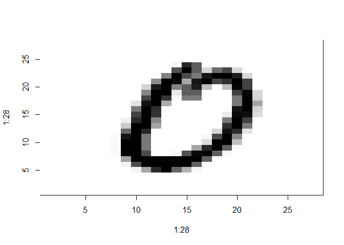
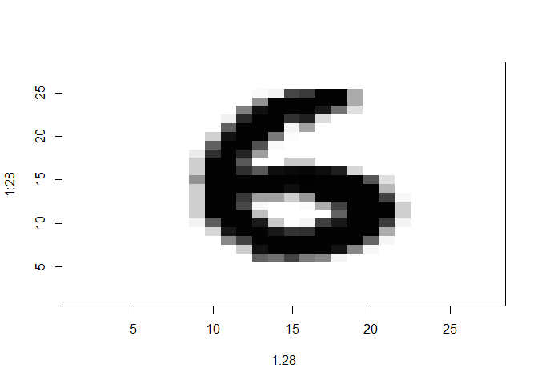

DeepLearning MNIST en H2O
================

\_\_Fuente:
<http://docs.h2o.ai/h2o/latest-stable/h2o-docs/booklets/DeepLearningBooklet.pdf__>

Usando el framework de `H2O` para reconocimiento de dígitos (MNIST).

## Iniciar cluster de h2o:

``` r
library(h2o)
h2o.init()
```

    ##  Connection successful!
    ## 
    ## R is connected to the H2O cluster: 
    ##     H2O cluster uptime:         38 minutes 326 milliseconds 
    ##     H2O cluster timezone:       America/Santiago 
    ##     H2O data parsing timezone:  UTC 
    ##     H2O cluster version:        3.22.1.1 
    ##     H2O cluster version age:    5 months and 28 days !!! 
    ##     H2O cluster name:           H2O_started_from_R_psaid_hpw848 
    ##     H2O cluster total nodes:    1 
    ##     H2O cluster total memory:   1.38 GB 
    ##     H2O cluster total cores:    8 
    ##     H2O cluster allowed cores:  8 
    ##     H2O cluster healthy:        TRUE 
    ##     H2O Connection ip:          localhost 
    ##     H2O Connection port:        54321 
    ##     H2O Connection proxy:       NA 
    ##     H2O Internal Security:      FALSE 
    ##     H2O API Extensions:         Algos, AutoML, Core V3, Core V4 
    ##     R Version:                  R version 3.6.0 (2019-04-26)

    ## Warning in h2o.clusterInfo(): 
    ## Your H2O cluster version is too old (5 months and 28 days)!
    ## Please download and install the latest version from http://h2o.ai/download/

``` r
#h2o.shutdown()
```

## Importar datos

``` r
train_file <- "https://h2o-public-test-data.s3.amazonaws.com/bigdata/laptop/mnist/train.csv.gz"
test_file <- "https://h2o-public-test-data.s3.amazonaws.com/bigdata/laptop/mnist/test.csv.gz"

train <- h2o.importFile(train_file)
```

    ## 
      |                                                                       
      |                                                                 |   0%
      |                                                                       
      |==                                                               |   3%
      |                                                                       
      |====                                                             |   6%
      |                                                                       
      |======                                                           |   9%
      |                                                                       
      |========                                                         |  13%
      |                                                                       
      |==========                                                       |  16%
      |                                                                       
      |============                                                     |  19%
      |                                                                       
      |==============                                                   |  22%
      |                                                                       
      |================                                                 |  25%
      |                                                                       
      |==================                                               |  28%
      |                                                                       
      |====================                                             |  31%
      |                                                                       
      |======================                                           |  34%
      |                                                                       
      |========================                                         |  38%
      |                                                                       
      |==========================                                       |  41%
      |                                                                       
      |============================                                     |  44%
      |                                                                       
      |==============================                                   |  47%
      |                                                                       
      |=================================                                |  50%
      |                                                                       
      |===================================                              |  53%
      |                                                                       
      |=====================================                            |  56%
      |                                                                       
      |=======================================                          |  59%
      |                                                                       
      |=========================================                        |  63%
      |                                                                       
      |===========================================                      |  66%
      |                                                                       
      |=============================================                    |  69%
      |                                                                       
      |===============================================                  |  72%
      |                                                                       
      |=================================================                |  75%
      |                                                                       
      |===================================================              |  78%
      |                                                                       
      |=====================================================            |  81%
      |                                                                       
      |=======================================================          |  84%
      |                                                                       
      |=========================================================        |  88%
      |                                                                       
      |===========================================================      |  91%
      |                                                                       
      |=============================================================    |  94%
      |                                                                       
      |===============================================================  |  97%
      |                                                                       
      |=================================================================| 100%

``` r
test <- h2o.importFile(test_file)
```

    ## 
      |                                                                       
      |                                                                 |   0%
      |                                                                       
      |====                                                             |   6%
      |                                                                       
      |======                                                           |   9%
      |                                                                       
      |========                                                         |  13%
      |                                                                       
      |==========                                                       |  16%
      |                                                                       
      |============                                                     |  19%
      |                                                                       
      |==============                                                   |  22%
      |                                                                       
      |================                                                 |  25%
      |                                                                       
      |==================                                               |  28%
      |                                                                       
      |====================                                             |  31%
      |                                                                       
      |======================                                           |  34%
      |                                                                       
      |========================                                         |  38%
      |                                                                       
      |==========================                                       |  41%
      |                                                                       
      |============================                                     |  44%
      |                                                                       
      |==============================                                   |  47%
      |                                                                       
      |=================================                                |  50%
      |                                                                       
      |===================================                              |  53%
      |                                                                       
      |=====================================                            |  56%
      |                                                                       
      |=======================================                          |  59%
      |                                                                       
      |=========================================                        |  63%
      |                                                                       
      |===========================================                      |  66%
      |                                                                       
      |=============================================                    |  69%
      |                                                                       
      |===============================================                  |  72%
      |                                                                       
      |=================================================                |  75%
      |                                                                       
      |===================================================              |  78%
      |                                                                       
      |=====================================================            |  81%
      |                                                                       
      |=======================================================          |  84%
      |                                                                       
      |=========================================================        |  88%
      |                                                                       
      |===========================================================      |  91%
      |                                                                       
      |=============================================================    |  94%
      |                                                                       
      |===============================================================  |  97%
      |                                                                       
      |=================================================================| 100%

## Explorar datos

``` r
train_1 <- as.data.frame(train)
```

La función `dim(train_1)` muestra que el conjunto de entrenamiento tiene
60.000 observaciones con 785 columnas, de los cuales 784 corresponden a
los pixeles (28 por alto x 28 por ancho), mientras la columna 785 indica
el dígito correspondiente

``` r
dim(train_1) # 60000 obs , 785 columnas 
```

    ## [1] 60000   785

``` r
str(train_1$C1)
```

    ##  int [1:60000] 0 0 0 0 0 0 0 0 0 0 ...

``` r
(as.numeric(train_1[1,])) # primera observacion
```

    ##   [1]   0   0   0   0   0   0   0   0   0   0   0   0   0   0   0   0   0
    ##  [18]   0   0   0   0   0   0   0   0   0   0   0   0   0   0   0   0   0
    ##  [35]   0   0   0   0   0   0   0   0   0   0   0   0   0   0   0   0   0
    ##  [52]   0   0   0   0   0   0   0   0   0   0   0   0   0   0   0   0   0
    ##  [69]   0   0   0   0   0   0   0   0   0   0   0   0   0   0   0   0   0
    ##  [86]   0   0   0   0   0   0   0   0   0   0   0   0   0   0   0   0   0
    ## [103]   0   0   0   0   0   0   0   0   0   0   0   0   0   0   0   0  25
    ## [120] 105 105 105 123 253 253 253 253 255 253 156  55   0   0   0   0   0
    ## [137]   0   0   0   0   0   0   0   0   0   0 183 252 252 252 252 252 252
    ## [154] 252 252 253 252 252 231 164  18   0   0   0   0   0   0   0   0   0
    ## [171]   0   0   0   0 208 252 252 252 252 252 252 252 252 253 252 252 252
    ## [188] 252  74   0   0   0   0   0   0   0   0   0   0   0   0   0 110 210
    ## [205] 252 216 132 132 132 132 132 133 160 252 252 252 143   0   0   0   0
    ## [222]   0   0   0   0   0   0   0   0   0   0  19  29  20   0   0   0   0
    ## [239]   0   0  60 252 252 252 178   0   0   0   0   0   0   0   0   0   0
    ## [256]   0   0   0   0   0   0   0   0   0   0   0   0  13 170 252 252 243
    ## [273]  65   0   0   0   0   0   0   0   0   0   0   0   0   0   0   0   0
    ## [290]   0   0   0   0   0   0 183 252 252 252 177   0   0   0   0   0   0
    ## [307]   0   0   0   0   0   0   0   0   0   0   0   0   0   0   0   0  53
    ## [324] 253 252 252 209  27   0   0   0   0   0   0   0   0   0   0   0   0
    ## [341]   0   0   0   0   0   0   0   0   0  61 228 253 252 240  31   0   0
    ## [358]   0   0   0   0   0   0   0   0   0   0   0   0   0   0   0   0   0
    ## [375]   0   0   0 193 252 253 216  97   0   0   0   0   0   0   0   0   0
    ## [392]   0   0   0   0   0   0   0   0   0   0   0   0  56 245 253 253 255
    ## [409] 131   0   0   0   0   0   0   0   0   0   0   0   0   0   0   0   0
    ## [426]   0   0   0   0   0  61 231 252 252 252  44   8   0   0   0   0   0
    ## [443]   0   0   0   0   0   0   0   0   0   0   0   0   0   0   0  49 226
    ## [460] 252 252 249 148   0   0   0   0   0   0   0   0   0   0   0   0   0
    ## [477]   0   0   0   0   0   0   0   0  57 158 252 252 252 136   0   0   0
    ## [494]   0   0   0  85 120 120  28   0   0   0   0   0   0   0   0   0   0
    ## [511]   0  14 237 252 252 252 172   7   0   0  18  75  75 119 243 252 252
    ## [528] 190   0   0   0   0   0   0   0   0   0   0   0  15 252 252 252 252
    ## [545]  85  30  30 179 196 252 252 252 252 252 252 207   0   0   0   0   0
    ## [562]   0   0   0   0   0   0  15 252 252 252 252 252 252 252 253 252 252
    ## [579] 252 252 252 252 252 207   0   0   0   0   0   0   0   0   0   0   0
    ## [596]  15 252 252 252 252 252 252 252 253 252 252 209 162 162 162 162 133
    ## [613]   0   0   0   0   0   0   0   0   0   0   0  13 207 246 252 252 252
    ## [630] 252 225 208 171  59  31   0   0   0   0   0   0   0   0   0   0   0
    ## [647]   0   0   0   0   0   0   0 135 252 172 103 103  43   0   0   0   0
    ## [664]   0   0   0   0   0   0   0   0   0   0   0   0   0   0   0   0   0
    ## [681]   0   0   0   0   0   0   0   0   0   0   0   0   0   0   0   0   0
    ## [698]   0   0   0   0   0   0   0   0   0   0   0   0   0   0   0   0   0
    ## [715]   0   0   0   0   0   0   0   0   0   0   0   0   0   0   0   0   0
    ## [732]   0   0   0   0   0   0   0   0   0   0   0   0   0   0   0   0   0
    ## [749]   0   0   0   0   0   0   0   0   0   0   0   0   0   0   0   0   0
    ## [766]   0   0   0   0   0   0   0   0   0   0   0   0   0   0   0   0   0
    ## [783]   0   0   2

``` r
head(train_1$C785)
```

    ## [1] 2 3 0 0 2 7

### Imprimir dígitos

Se aplicó la función `t()` con la opción `rev` para girar el conjunto de
datos para facilitar la visualización. La función `img()` plotea los
dígitos

``` r
im <- matrix(as.numeric(train_1[4,1:784]), byrow=T, ncol = 28)
im <- t(apply(im,2,rev)) # se gira los datos para vizualizarlos 
image(1:28, 1:28, im, col=gray((255:0)/255))
```

<!-- -->

``` r
im <- matrix(as.numeric(train_1[9,1:784]), byrow=T, ncol = 28)
im <- t(apply(im,2,rev))
image(1:28, 1:28, im, col=gray((255:0)/255))
```

<!-- -->

## Preparando la configuración del modelo

### Especificar el nombre de las variables de entrada y salida

``` r
y <- "C785"
x <- setdiff(names(train), y)
```

Como el problema es de clasificación, las variables de respuesta se
transforman a factor

``` r
train[,y] <- as.factor(train[,y])
test[,y] <- as.factor(test[,y])
```

### Entrenamiento (básico)

``` r
model <- h2o.deeplearning(
    x = x,
    y = y,
    training_frame = train,
    validation_frame = test,
    distribution = "multinomial",
    activation = "RectifierWithDropout",
    hidden = c(32,32,32),
    input_dropout_ratio = 0.2,
    sparse = TRUE, #buscar q es sparse!!!!
    l1 = 1e-5,
    epochs = 10)
```

    ## Warning in .h2o.startModelJob(algo, params, h2oRestApiVersion): Dropping bad and constant columns: [C86, C85, C729, C728, C646, C645, C169, C760, C561, C53, C11, C55, C10, C54, C57, C12, C56, C58, C17, C19, C18, C731, C730, C20, C22, C21, C24, C23, C26, C25, C28, C27, C702, C701, C29, C700, C1, C2, C784, C3, C783, C4, C782, C5, C781, C6, C142, C7, C141, C8, C9, C31, C30, C32, C759, C758, C757, C756, C755, C477, C113, C674, C112, C673, C672, C84, C83].

    ## 
      |                                                                       
      |                                                                 |   0%
      |                                                                       
      |======                                                           |  10%
      |                                                                       
      |====================                                             |  30%
      |                                                                       
      |==========================                                       |  40%
      |                                                                       
      |================================                                 |  50%
      |                                                                       
      |==============================================                   |  70%
      |                                                                       
      |==========================================================       |  90%
      |                                                                       
      |=================================================================| 100%

El modelo solo se corrio por 10 épocas a modo de ejemplo.

### Salidas

``` r
# View specified parameters of the deep learning model
print(model@parameters)
```

    ## $model_id
    ## [1] "DeepLearning_model_R_1561556697365_3"
    ## 
    ## $training_frame
    ## [1] "RTMP_sid_acdf_3"
    ## 
    ## $validation_frame
    ## [1] "RTMP_sid_acdf_4"
    ## 
    ## $activation
    ## [1] "RectifierWithDropout"
    ## 
    ## $hidden
    ## [1] 32 32 32
    ## 
    ## $seed
    ## [1] -2.279216e+18
    ## 
    ## $input_dropout_ratio
    ## [1] 0.2
    ## 
    ## $l1
    ## [1] 1e-05
    ## 
    ## $distribution
    ## [1] "multinomial"
    ## 
    ## $sparse
    ## [1] TRUE
    ## 
    ## $x
    ##   [1] "C13"  "C14"  "C15"  "C16"  "C33"  "C34"  "C35"  "C36"  "C37"  "C38" 
    ##  [11] "C39"  "C40"  "C41"  "C42"  "C43"  "C44"  "C45"  "C46"  "C47"  "C48" 
    ##  [21] "C49"  "C50"  "C51"  "C52"  "C59"  "C60"  "C61"  "C62"  "C63"  "C64" 
    ##  [31] "C65"  "C66"  "C67"  "C68"  "C69"  "C70"  "C71"  "C72"  "C73"  "C74" 
    ##  [41] "C75"  "C76"  "C77"  "C78"  "C79"  "C80"  "C81"  "C82"  "C87"  "C88" 
    ##  [51] "C89"  "C90"  "C91"  "C92"  "C93"  "C94"  "C95"  "C96"  "C97"  "C98" 
    ##  [61] "C99"  "C100" "C101" "C102" "C103" "C104" "C105" "C106" "C107" "C108"
    ##  [71] "C109" "C110" "C111" "C114" "C115" "C116" "C117" "C118" "C119" "C120"
    ##  [81] "C121" "C122" "C123" "C124" "C125" "C126" "C127" "C128" "C129" "C130"
    ##  [91] "C131" "C132" "C133" "C134" "C135" "C136" "C137" "C138" "C139" "C140"
    ## [101] "C143" "C144" "C145" "C146" "C147" "C148" "C149" "C150" "C151" "C152"
    ## [111] "C153" "C154" "C155" "C156" "C157" "C158" "C159" "C160" "C161" "C162"
    ## [121] "C163" "C164" "C165" "C166" "C167" "C168" "C170" "C171" "C172" "C173"
    ## [131] "C174" "C175" "C176" "C177" "C178" "C179" "C180" "C181" "C182" "C183"
    ## [141] "C184" "C185" "C186" "C187" "C188" "C189" "C190" "C191" "C192" "C193"
    ## [151] "C194" "C195" "C196" "C197" "C198" "C199" "C200" "C201" "C202" "C203"
    ## [161] "C204" "C205" "C206" "C207" "C208" "C209" "C210" "C211" "C212" "C213"
    ## [171] "C214" "C215" "C216" "C217" "C218" "C219" "C220" "C221" "C222" "C223"
    ## [181] "C224" "C225" "C226" "C227" "C228" "C229" "C230" "C231" "C232" "C233"
    ## [191] "C234" "C235" "C236" "C237" "C238" "C239" "C240" "C241" "C242" "C243"
    ## [201] "C244" "C245" "C246" "C247" "C248" "C249" "C250" "C251" "C252" "C253"
    ## [211] "C254" "C255" "C256" "C257" "C258" "C259" "C260" "C261" "C262" "C263"
    ## [221] "C264" "C265" "C266" "C267" "C268" "C269" "C270" "C271" "C272" "C273"
    ## [231] "C274" "C275" "C276" "C277" "C278" "C279" "C280" "C281" "C282" "C283"
    ## [241] "C284" "C285" "C286" "C287" "C288" "C289" "C290" "C291" "C292" "C293"
    ## [251] "C294" "C295" "C296" "C297" "C298" "C299" "C300" "C301" "C302" "C303"
    ## [261] "C304" "C305" "C306" "C307" "C308" "C309" "C310" "C311" "C312" "C313"
    ## [271] "C314" "C315" "C316" "C317" "C318" "C319" "C320" "C321" "C322" "C323"
    ## [281] "C324" "C325" "C326" "C327" "C328" "C329" "C330" "C331" "C332" "C333"
    ## [291] "C334" "C335" "C336" "C337" "C338" "C339" "C340" "C341" "C342" "C343"
    ## [301] "C344" "C345" "C346" "C347" "C348" "C349" "C350" "C351" "C352" "C353"
    ## [311] "C354" "C355" "C356" "C357" "C358" "C359" "C360" "C361" "C362" "C363"
    ## [321] "C364" "C365" "C366" "C367" "C368" "C369" "C370" "C371" "C372" "C373"
    ## [331] "C374" "C375" "C376" "C377" "C378" "C379" "C380" "C381" "C382" "C383"
    ## [341] "C384" "C385" "C386" "C387" "C388" "C389" "C390" "C391" "C392" "C393"
    ## [351] "C394" "C395" "C396" "C397" "C398" "C399" "C400" "C401" "C402" "C403"
    ## [361] "C404" "C405" "C406" "C407" "C408" "C409" "C410" "C411" "C412" "C413"
    ## [371] "C414" "C415" "C416" "C417" "C418" "C419" "C420" "C421" "C422" "C423"
    ## [381] "C424" "C425" "C426" "C427" "C428" "C429" "C430" "C431" "C432" "C433"
    ## [391] "C434" "C435" "C436" "C437" "C438" "C439" "C440" "C441" "C442" "C443"
    ## [401] "C444" "C445" "C446" "C447" "C448" "C449" "C450" "C451" "C452" "C453"
    ## [411] "C454" "C455" "C456" "C457" "C458" "C459" "C460" "C461" "C462" "C463"
    ## [421] "C464" "C465" "C466" "C467" "C468" "C469" "C470" "C471" "C472" "C473"
    ## [431] "C474" "C475" "C476" "C478" "C479" "C480" "C481" "C482" "C483" "C484"
    ## [441] "C485" "C486" "C487" "C488" "C489" "C490" "C491" "C492" "C493" "C494"
    ## [451] "C495" "C496" "C497" "C498" "C499" "C500" "C501" "C502" "C503" "C504"
    ## [461] "C505" "C506" "C507" "C508" "C509" "C510" "C511" "C512" "C513" "C514"
    ## [471] "C515" "C516" "C517" "C518" "C519" "C520" "C521" "C522" "C523" "C524"
    ## [481] "C525" "C526" "C527" "C528" "C529" "C530" "C531" "C532" "C533" "C534"
    ## [491] "C535" "C536" "C537" "C538" "C539" "C540" "C541" "C542" "C543" "C544"
    ## [501] "C545" "C546" "C547" "C548" "C549" "C550" "C551" "C552" "C553" "C554"
    ## [511] "C555" "C556" "C557" "C558" "C559" "C560" "C562" "C563" "C564" "C565"
    ## [521] "C566" "C567" "C568" "C569" "C570" "C571" "C572" "C573" "C574" "C575"
    ## [531] "C576" "C577" "C578" "C579" "C580" "C581" "C582" "C583" "C584" "C585"
    ## [541] "C586" "C587" "C588" "C589" "C590" "C591" "C592" "C593" "C594" "C595"
    ## [551] "C596" "C597" "C598" "C599" "C600" "C601" "C602" "C603" "C604" "C605"
    ## [561] "C606" "C607" "C608" "C609" "C610" "C611" "C612" "C613" "C614" "C615"
    ## [571] "C616" "C617" "C618" "C619" "C620" "C621" "C622" "C623" "C624" "C625"
    ## [581] "C626" "C627" "C628" "C629" "C630" "C631" "C632" "C633" "C634" "C635"
    ## [591] "C636" "C637" "C638" "C639" "C640" "C641" "C642" "C643" "C644" "C647"
    ## [601] "C648" "C649" "C650" "C651" "C652" "C653" "C654" "C655" "C656" "C657"
    ## [611] "C658" "C659" "C660" "C661" "C662" "C663" "C664" "C665" "C666" "C667"
    ## [621] "C668" "C669" "C670" "C671" "C675" "C676" "C677" "C678" "C679" "C680"
    ## [631] "C681" "C682" "C683" "C684" "C685" "C686" "C687" "C688" "C689" "C690"
    ## [641] "C691" "C692" "C693" "C694" "C695" "C696" "C697" "C698" "C699" "C703"
    ## [651] "C704" "C705" "C706" "C707" "C708" "C709" "C710" "C711" "C712" "C713"
    ## [661] "C714" "C715" "C716" "C717" "C718" "C719" "C720" "C721" "C722" "C723"
    ## [671] "C724" "C725" "C726" "C727" "C732" "C733" "C734" "C735" "C736" "C737"
    ## [681] "C738" "C739" "C740" "C741" "C742" "C743" "C744" "C745" "C746" "C747"
    ## [691] "C748" "C749" "C750" "C751" "C752" "C753" "C754" "C761" "C762" "C763"
    ## [701] "C764" "C765" "C766" "C767" "C768" "C769" "C770" "C771" "C772" "C773"
    ## [711] "C774" "C775" "C776" "C777" "C778" "C779" "C780"
    ## 
    ## $y
    ## [1] "C785"

``` r
# Examine the performance of the trained model
print(model)# display all performance metrics
```

    ## Model Details:
    ## ==============
    ## 
    ## H2OMultinomialModel: deeplearning
    ## Model ID:  DeepLearning_model_R_1561556697365_3 
    ## Status of Neuron Layers: predicting C785, 10-class classification, multinomial distribution, CrossEntropy loss, 25.418 weights/biases, 529,7 KB, 600.000 training samples, mini-batch size 1
    ##   layer units             type dropout       l1       l2 mean_rate
    ## 1     1   717            Input 20.00 %       NA       NA        NA
    ## 2     2    32 RectifierDropout 50.00 % 0.000010 0.000000  0.029910
    ## 3     3    32 RectifierDropout 50.00 % 0.000010 0.000000  0.000359
    ## 4     4    32 RectifierDropout 50.00 % 0.000010 0.000000  0.000557
    ## 5     5    10          Softmax      NA 0.000010 0.000000  0.002597
    ##   rate_rms momentum mean_weight weight_rms mean_bias bias_rms
    ## 1       NA       NA          NA         NA        NA       NA
    ## 2 0.173522 0.000000   -0.009520   0.066708  0.465037 0.277793
    ## 3 0.000206 0.000000   -0.025123   0.201079  0.775836 0.271249
    ## 4 0.000277 0.000000   -0.046820   0.210071  0.760028 0.384977
    ## 5 0.002564 0.000000   -0.457772   1.008595 -2.035386 0.961091
    ## 
    ## 
    ## H2OMultinomialMetrics: deeplearning
    ## ** Reported on training data. **
    ## ** Metrics reported on temporary training frame with 9945 samples **
    ## 
    ## Training Set Metrics: 
    ## =====================
    ## 
    ## MSE: (Extract with `h2o.mse`) 0.09234385
    ## RMSE: (Extract with `h2o.rmse`) 0.3038813
    ## Logloss: (Extract with `h2o.logloss`) 0.3205148
    ## Mean Per-Class Error: 0.08835063
    ## Confusion Matrix: Extract with `h2o.confusionMatrix(<model>,train = TRUE)`)
    ## =========================================================================
    ## Confusion Matrix: Row labels: Actual class; Column labels: Predicted class
    ##          0    1   2   3   4   5    6    7    8    9  Error          Rate
    ## 0      955    0   2   1   2   7   15    0   13    0 0.0402 =    40 / 995
    ## 1        0 1031   3   1   0   2    2    4   17    2 0.0292 =  31 / 1.062
    ## 2        2    1 904  17   6   1   10    8   26    1 0.0738 =    72 / 976
    ## 3        3    1  29 832   0  60    2   15   51    6 0.1672 =   167 / 999
    ## 4        1    2   7   0 873   3   16    1   12   54 0.0991 =    96 / 969
    ## 5        9    0   9  11   7 703   16    1  148    5 0.2266 =   206 / 909
    ## 6        6    3   5   0   3   8  975    0   10    0 0.0347 =  35 / 1.010
    ## 7        2    2  14   2  12   0    3  984    4   23 0.0593 =  62 / 1.046
    ## 8        1    7   9   4   0  12    8    2  905    4 0.0494 =    47 / 952
    ## 9        3    3   1   2  28   3    0   33   34  920 0.1042 = 107 / 1.027
    ## Totals 982 1050 983 870 931 799 1047 1048 1220 1015 0.0868 = 863 / 9.945
    ## 
    ## Hit Ratio Table: Extract with `h2o.hit_ratio_table(<model>,train = TRUE)`
    ## =======================================================================
    ## Top-10 Hit Ratios: 
    ##     k hit_ratio
    ## 1   1  0.913223
    ## 2   2  0.967220
    ## 3   3  0.982504
    ## 4   4  0.989442
    ## 5   5  0.993464
    ## 6   6  0.995877
    ## 7   7  0.997788
    ## 8   8  0.999497
    ## 9   9  0.999799
    ## 10 10  1.000000
    ## 
    ## 
    ## H2OMultinomialMetrics: deeplearning
    ## ** Reported on validation data. **
    ## ** Metrics reported on full validation frame **
    ## 
    ## Validation Set Metrics: 
    ## =====================
    ## 
    ## Extract validation frame with `h2o.getFrame("RTMP_sid_acdf_4")`
    ## MSE: (Extract with `h2o.mse`) 0.09233211
    ## RMSE: (Extract with `h2o.rmse`) 0.303862
    ## Logloss: (Extract with `h2o.logloss`) 0.3322786
    ## Mean Per-Class Error: 0.08546429
    ## Confusion Matrix: Extract with `h2o.confusionMatrix(<model>,valid = TRUE)`)
    ## =========================================================================
    ## Confusion Matrix: Row labels: Actual class; Column labels: Predicted class
    ##          0    1    2   3   4   5   6    7    8   9  Error           Rate
    ## 0      951    0    0   2   0   4  11    2   10   0 0.0296 =     29 / 980
    ## 1        0 1102    4   1   0   0   6    1   21   0 0.0291 =   33 / 1.135
    ## 2        4    2  948  12   6   1  13   10   35   1 0.0814 =   84 / 1.032
    ## 3        2    0   27 859   1  46   0   18   56   1 0.1495 =  151 / 1.010
    ## 4        0    0    6   0 904   0  14    3   16  39 0.0794 =     78 / 982
    ## 5        6    2    3  21   5 699  15    9  126   6 0.2164 =    193 / 892
    ## 6       12    3    5   0   6   9 916    0    7   0 0.0438 =     42 / 958
    ## 7        1    5   24   6   6   0   1  956   10  19 0.0700 =   72 / 1.028
    ## 8        6    3    5   3   4   9  10    8  924   2 0.0513 =     50 / 974
    ## 9        8    3    2   6  36   6   1   10   33 904 0.1041 =  105 / 1.009
    ## Totals 990 1120 1024 910 968 774 987 1017 1238 972 0.0837 = 837 / 10.000
    ## 
    ## Hit Ratio Table: Extract with `h2o.hit_ratio_table(<model>,valid = TRUE)`
    ## =======================================================================
    ## Top-10 Hit Ratios: 
    ##     k hit_ratio
    ## 1   1  0.916300
    ## 2   2  0.963600
    ## 3   3  0.980300
    ## 4   4  0.987200
    ## 5   5  0.992700
    ## 6   6  0.995900
    ## 7   7  0.997700
    ## 8   8  0.999300
    ## 9   9  1.000000
    ## 10 10  1.000000

``` r
print(h2o.performance(model))# training metrics
```

    ## H2OMultinomialMetrics: deeplearning
    ## ** Reported on training data. **
    ## ** Metrics reported on temporary training frame with 9945 samples **
    ## 
    ## Training Set Metrics: 
    ## =====================
    ## 
    ## MSE: (Extract with `h2o.mse`) 0.09234385
    ## RMSE: (Extract with `h2o.rmse`) 0.3038813
    ## Logloss: (Extract with `h2o.logloss`) 0.3205148
    ## Mean Per-Class Error: 0.08835063
    ## Confusion Matrix: Extract with `h2o.confusionMatrix(<model>,train = TRUE)`)
    ## =========================================================================
    ## Confusion Matrix: Row labels: Actual class; Column labels: Predicted class
    ##          0    1   2   3   4   5    6    7    8    9  Error          Rate
    ## 0      955    0   2   1   2   7   15    0   13    0 0.0402 =    40 / 995
    ## 1        0 1031   3   1   0   2    2    4   17    2 0.0292 =  31 / 1.062
    ## 2        2    1 904  17   6   1   10    8   26    1 0.0738 =    72 / 976
    ## 3        3    1  29 832   0  60    2   15   51    6 0.1672 =   167 / 999
    ## 4        1    2   7   0 873   3   16    1   12   54 0.0991 =    96 / 969
    ## 5        9    0   9  11   7 703   16    1  148    5 0.2266 =   206 / 909
    ## 6        6    3   5   0   3   8  975    0   10    0 0.0347 =  35 / 1.010
    ## 7        2    2  14   2  12   0    3  984    4   23 0.0593 =  62 / 1.046
    ## 8        1    7   9   4   0  12    8    2  905    4 0.0494 =    47 / 952
    ## 9        3    3   1   2  28   3    0   33   34  920 0.1042 = 107 / 1.027
    ## Totals 982 1050 983 870 931 799 1047 1048 1220 1015 0.0868 = 863 / 9.945
    ## 
    ## Hit Ratio Table: Extract with `h2o.hit_ratio_table(<model>,train = TRUE)`
    ## =======================================================================
    ## Top-10 Hit Ratios: 
    ##     k hit_ratio
    ## 1   1  0.913223
    ## 2   2  0.967220
    ## 3   3  0.982504
    ## 4   4  0.989442
    ## 5   5  0.993464
    ## 6   6  0.995877
    ## 7   7  0.997788
    ## 8   8  0.999497
    ## 9   9  0.999799
    ## 10 10  1.000000

``` r
print(h2o.performance(model, valid = TRUE))# validation metrics 
```

    ## H2OMultinomialMetrics: deeplearning
    ## ** Reported on validation data. **
    ## ** Metrics reported on full validation frame **
    ## 
    ## Validation Set Metrics: 
    ## =====================
    ## 
    ## Extract validation frame with `h2o.getFrame("RTMP_sid_acdf_4")`
    ## MSE: (Extract with `h2o.mse`) 0.09233211
    ## RMSE: (Extract with `h2o.rmse`) 0.303862
    ## Logloss: (Extract with `h2o.logloss`) 0.3322786
    ## Mean Per-Class Error: 0.08546429
    ## Confusion Matrix: Extract with `h2o.confusionMatrix(<model>,valid = TRUE)`)
    ## =========================================================================
    ## Confusion Matrix: Row labels: Actual class; Column labels: Predicted class
    ##          0    1    2   3   4   5   6    7    8   9  Error           Rate
    ## 0      951    0    0   2   0   4  11    2   10   0 0.0296 =     29 / 980
    ## 1        0 1102    4   1   0   0   6    1   21   0 0.0291 =   33 / 1.135
    ## 2        4    2  948  12   6   1  13   10   35   1 0.0814 =   84 / 1.032
    ## 3        2    0   27 859   1  46   0   18   56   1 0.1495 =  151 / 1.010
    ## 4        0    0    6   0 904   0  14    3   16  39 0.0794 =     78 / 982
    ## 5        6    2    3  21   5 699  15    9  126   6 0.2164 =    193 / 892
    ## 6       12    3    5   0   6   9 916    0    7   0 0.0438 =     42 / 958
    ## 7        1    5   24   6   6   0   1  956   10  19 0.0700 =   72 / 1.028
    ## 8        6    3    5   3   4   9  10    8  924   2 0.0513 =     50 / 974
    ## 9        8    3    2   6  36   6   1   10   33 904 0.1041 =  105 / 1.009
    ## Totals 990 1120 1024 910 968 774 987 1017 1238 972 0.0837 = 837 / 10.000
    ## 
    ## Hit Ratio Table: Extract with `h2o.hit_ratio_table(<model>,valid = TRUE)`
    ## =======================================================================
    ## Top-10 Hit Ratios: 
    ##     k hit_ratio
    ## 1   1  0.916300
    ## 2   2  0.963600
    ## 3   3  0.980300
    ## 4   4  0.987200
    ## 5   5  0.992700
    ## 6   6  0.995900
    ## 7   7  0.997700
    ## 8   8  0.999300
    ## 9   9  1.000000
    ## 10 10  1.000000

``` r
# Get MSE only
print(h2o.mse(model, valid = TRUE))
```

    ## [1] 0.09233211

``` r
#Cross-validated MSE
#h2o.mse(model_cv, xval = TRUE) #FALTA
```

## Validación cruzada

O N-fold Cross-Validation. Para guardar predicciones de la VC fijar el
parámetro `keepcrossvalidationpredictions` como `TRUE`. También se puede
especificar las filas por medio de `foldcolumn`. Por defecto,
`foldcolumn` es aleatorio.

``` r
#Perform 5-fold cross-validation on training_frame
model_cv <- h2o.deeplearning(
    x = x,
    y = y,
    training_frame = train,
    distribution = "multinomial",
    activation = "RectifierWithDropout",
    hidden = c(32,32,32),
    input_dropout_ratio = 0.2,
    sparse = TRUE,
    l1 = 1e-5,
    epochs = 10,
    nfolds = 5)
```

    ## Warning in .h2o.startModelJob(algo, params, h2oRestApiVersion): Dropping bad and constant columns: [C86, C85, C729, C728, C646, C645, C169, C760, C561, C53, C11, C55, C10, C54, C57, C12, C56, C58, C17, C19, C18, C731, C730, C20, C22, C21, C24, C23, C26, C25, C28, C27, C702, C701, C29, C700, C1, C2, C784, C3, C783, C4, C782, C5, C781, C6, C142, C7, C141, C8, C9, C31, C30, C32, C759, C758, C757, C756, C755, C477, C113, C674, C112, C673, C672, C84, C83].

    ## 
      |                                                                       
      |                                                                 |   0%
      |                                                                       
      |==                                                               |   3%
      |                                                                       
      |===                                                              |   4%
      |                                                                       
      |====                                                             |   7%
      |                                                                       
      |======                                                           |   9%
      |                                                                       
      |========                                                         |  12%
      |                                                                       
      |==========                                                       |  15%
      |                                                                       
      |===========                                                      |  17%
      |                                                                       
      |============                                                     |  19%
      |                                                                       
      |===============                                                  |  23%
      |                                                                       
      |================                                                 |  24%
      |                                                                       
      |=================                                                |  27%
      |                                                                       
      |====================                                             |  31%
      |                                                                       
      |======================                                           |  33%
      |                                                                       
      |=======================                                          |  35%
      |                                                                       
      |=======================                                          |  36%
      |                                                                       
      |=========================                                        |  39%
      |                                                                       
      |===========================                                      |  41%
      |                                                                       
      |=============================                                    |  44%
      |                                                                       
      |===============================                                  |  48%
      |                                                                       
      |================================                                 |  49%
      |                                                                       
      |==================================                               |  52%
      |                                                                       
      |===================================                              |  53%
      |                                                                       
      |===================================                              |  55%
      |                                                                       
      |=====================================                            |  57%
      |                                                                       
      |=======================================                          |  60%
      |                                                                       
      |========================================                         |  61%
      |                                                                       
      |==========================================                       |  64%
      |                                                                       
      |===========================================                      |  67%
      |                                                                       
      |=============================================                    |  69%
      |                                                                       
      |===============================================                  |  72%
      |                                                                       
      |=================================================                |  75%
      |                                                                       
      |===================================================              |  79%
      |                                                                       
      |=====================================================            |  81%
      |                                                                       
      |=======================================================          |  85%
      |                                                                       
      |========================================================         |  87%
      |                                                                       
      |==========================================================       |  89%
      |                                                                       
      |============================================================     |  92%
      |                                                                       
      |==============================================================   |  95%
      |                                                                       
      |================================================================ |  98%
      |                                                                       
      |=================================================================| 100%

### Métricas del CV

``` r
#Cross-validated MSE
h2o.mse(model_cv, xval = TRUE)
```

    ## [1] 0.1288316

El valor del error de entrenamiento está basado en el parámetro
`score_training_samples`, el cual especifica el numero aleatorio de
puntos de ejemplos de entrenamiento usado para el *scoring* (el valor
por defecto es 10.000 puntos). El error de validacion esta basado sobre
el parámetro `score_validation_samples`, el cual configura el mismo
valor sobre el conjunto de validación (por defecto, este es el conjunto
de validación por completo).

> [Scoring](https://s3.amazonaws.com/h2o-release/h2o/rel-markov/1/docs-website/datascience/deeplearning.html):
> If a validation set was given, the scoring results are displayed for
> the validation set (or a sample thereof). Otherwise, scoring is
> performed on the training dataset (or a sample thereof).

    If a validation set was given, the scoring results are displayed for the validation set (or a sample thereof). Otherwise, scoring is performed on the training dataset (or a sample thereof).

En general, eligiendo un número grande de puntos de ejemplos lleva a un
mejor entendimiento del rendimiento del modelo sobre el tu conjunto de
datos; fijando cualquiera de estos parámetros en 0 automáticamente usas
el conjunto entero para el *scoring*.  
Sin embargo, cualquiera de los metodos de permite controlar el minimo o
maximo de tiempo gastado sobre el *scoring* con los parámetros
`score_interval` y `score_duty_cycle`.  
Si el parámetro `overwrite_with_best_model` está activado, estos
parámetros *scoring* afectan al modelo final. Esta opción selecciona el
modelo con más bajo error de validación durante el entrenamiento (basado
sobre los puntos de ejemplos usados para *scoring*) como el modelo final
después de entrenamiento. Si un conjunto de datos no está identificado
como conjunto de validación, el conjunto de entrenamiento es usado por
defecto, en este caso, ambos `score_training_samples` o
`score_validation_samples` controlarán el calculo del error durante el
entrenamiento y consecuentemente, el modelo seleccionado como el mejor.

## Estimaciones

Una vez tengamos un modelo satisfactorio (determinado por validación o
métricas de CV), se usa el comando `h2o.predict()` para calcular y
almacenar las predicciones sobre un conjunto nuevo de datos.

``` r
#lassify the test set (predict class labels)
# This also returns the probability for each class
pred <- h2o.predict(model, newdata = test)
```

    ## 
      |                                                                       
      |                                                                 |   0%
      |                                                                       
      |=================================================================| 100%

``` r
# Take a look at the predictions
head(pred)
```

    ##   predict           p0           p1           p2           p3           p4
    ## 1       8 5.916685e-03 1.189548e-02 1.315505e-02 1.623983e-02 6.250161e-03
    ## 2       3 4.724986e-04 9.306182e-04 9.030625e-03 9.518293e-01 7.186520e-05
    ## 3       8 2.041287e-01 3.236425e-03 4.550537e-02 4.013814e-02 5.087026e-02
    ## 4       0 9.132045e-01 6.722962e-05 3.267654e-03 1.680776e-03 7.630278e-03
    ## 5       1 5.371797e-09 9.996462e-01 4.997328e-07 5.426316e-06 1.143495e-07
    ## 6       5 2.736239e-02 5.896637e-03 4.984269e-03 1.645135e-02 1.031600e-02
    ##             p5           p6           p7           p8           p9
    ## 1 4.469240e-02 5.885408e-03 0.0021584181 8.796304e-01 1.417618e-02
    ## 2 2.485858e-02 1.233588e-05 0.0088886579 2.466814e-03 1.438715e-03
    ## 3 1.661355e-01 5.660876e-02 0.0039118917 4.160848e-01 1.338015e-02
    ## 4 2.183547e-02 4.230792e-02 0.0003171629 8.681366e-03 1.007649e-03
    ## 5 7.025357e-07 4.593299e-06 0.0003199082 1.560834e-05 6.958569e-06
    ## 6 6.173669e-01 2.107164e-02 0.0005970165 2.897057e-01 6.248144e-03

## Variables de importancia
